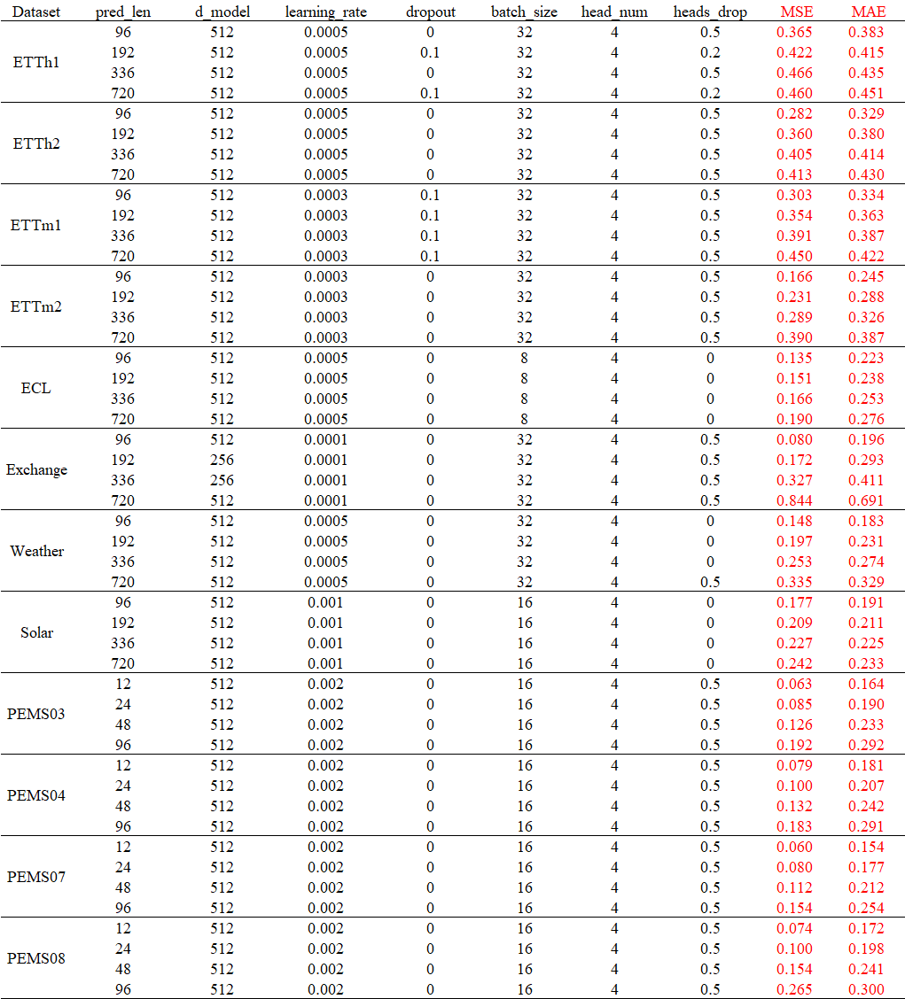

# PDEvo

This repository provides the anonymous implementation of **PDEvo**.

The repository contains the core model, training entry, data provider, basic layers, and utility files. The main model is implemented in `models/PDEvoNet.py`.

## Structure

```text
PDEvo/
├── Config/
│   └── config_hyperparams.png
├── data_provider/
├── exp/
├── layers/
├── models/
│   └── PDEvoNet.py
├── utils/
├── README.md
├── requirements.txt
└── run.py
```

## Model

The core implementation is provided in:

```text
models/PDEvoNet.py
```

## Hyperparameters

The hyperparameter settings for different datasets and prediction lengths are provided in:

```text
Config/config_hyperparams.png
```



## Usage

Install the required packages:

```bash
pip install -r requirements.txt
```

Run the model with:

```bash
python run.py
```

## Anonymous Review

This repository is prepared for anonymous review.

Identifying information, local paths, logs, checkpoints, model weights, and private metadata have been removed.
